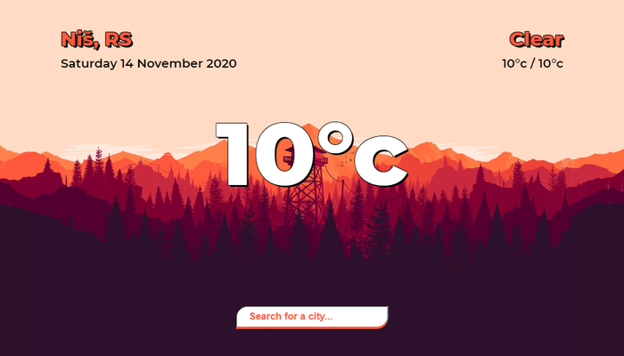
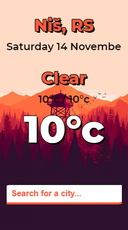

# WeatherApp
Simple weather app

WeatherApp made in single responsive web page with minimal usage of JavaScript.  
Project is hosted <a href="https://weather-app-32cb8.web.app/">here<a/>.

Main files of this project are: 

<b>index.html</b>, 
<b>script.js</b> (concat, babel, terser),  
<b>style.css</b> (autoprefixer, cssnano)  

